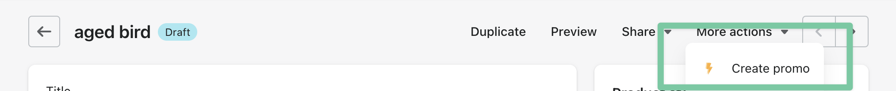
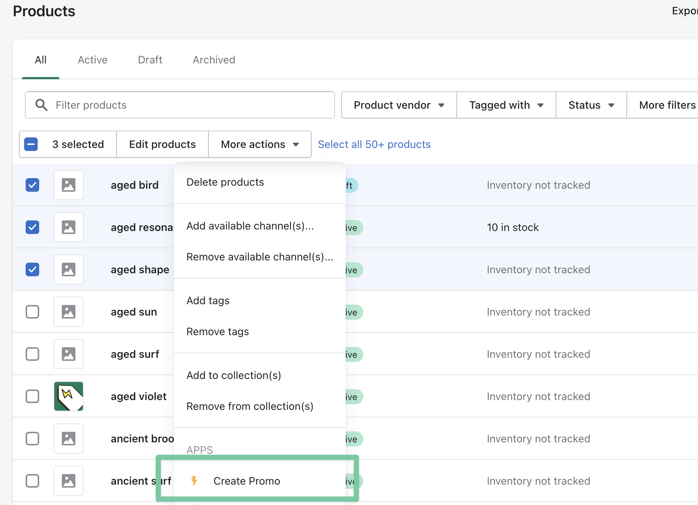
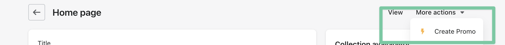

import Callout from 'nextra-theme-docs/callout'
import Bleed from 'nextra-theme-docs/bleed'

# Create promos directly from your Shopify Admin Dashboard.

If you want to create a promo when you are not using the app, you can use the admin links in the top right of the page as shown in the images below

## Product Detail Page

You can create a promo directly from a Product Detail Page in your dashboard, this will automatically open Flash Promos, Crate a new promo and show you a modal with the product pre selected for you, all you need to do is click on add and create your new promo!

<Bleed></Bleed>

## Products Oveview Page

You can create a promo directly from a Product Overview Page in your dashboard, this will automatically open Flash Promos, Crate a new promo and show you a modal with all the products pre selected for you, all you need to do is click on add and create your new promo!

<Bleed></Bleed>

## Collection Details Page

You can create a promo directly from a Collection Details Page in your dashboard, this will automatically open Flash Promos, Crate a new promo and show you a modal with all the products included in that collection pre selected for you, all you need to do is click on add and create your new promo!

<Bleed></Bleed>
