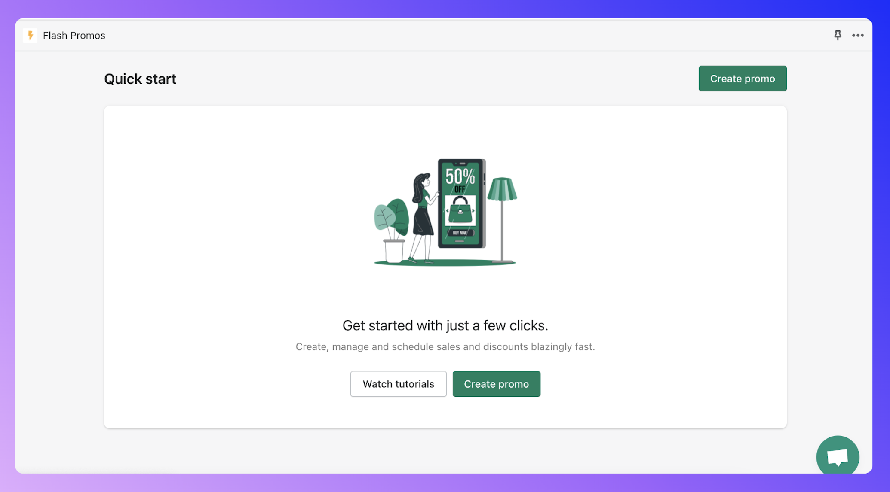

import Callout from 'nextra-theme-docs/callout'
import Bleed from 'nextra-theme-docs/bleed'

# Get Started

## Quick Start

<Callout>
  If you still haven't installed the app, you can do it
  [here](https://flashpromos.xyz).
</Callout>

After installing the app, you will get an screen like this one:

<Bleed></Bleed>

### Next Steps

You can decide to experiment with the app and see how it works **Creating your first promo** or you can click on **Watch tutorials** to learn how to use the app in a series of mini videos that go through each functionality.

The Mini video series is always available on the app's **Tutorials** page for you to consult, plus, all the videos's content is explained in this documentation site.

{/_ https://apps.shopify.com/flash-promos-1?#modal-show=ReviewListingModal _/}
