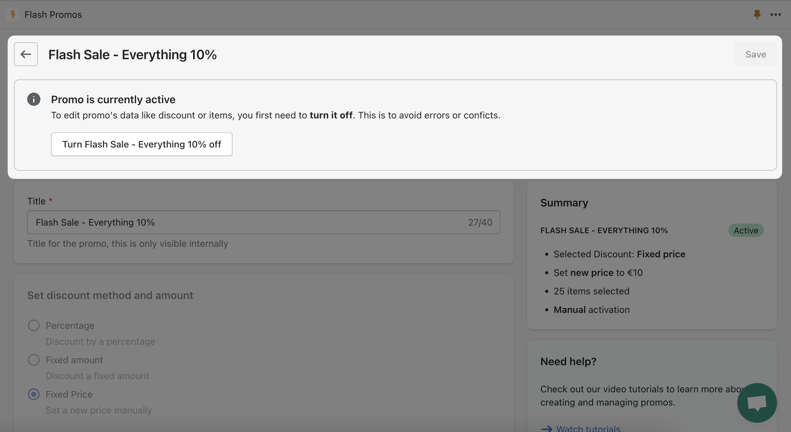

import Bleed from 'nextra-theme-docs/bleed'
import Callout from 'nextra-theme-docs/callout'

# Edit Promo

All the fields and sections are exactly the same as when creating a promo, however since the promo page is pre-filled with your promo's data there are some differences based on the following conditions:

`Promo is active` - The promo is active and **cannot** be modified, to edit it you'll need to turn it off first.

<Bleed></Bleed>

`Promo is scheduled and active` - The promo is scheduled and active, therefore if you want to deactivate it or edit it you'll need to switch to manual first and then deactivate it to edit.

<Bleed></Bleed>

`Promo is scheduled and inactive or manual and inactive` - You can still edit the promo until it's activated. This is the default state of a promo. You can also activate it by clicking the activate button right in the promo page.

<Bleed></Bleed>

<Callout>
  You can delete promos from the dasboard using the promo row small menu button.
  Note: you won;t be able to delete a promo if it's active
</Callout>

<Bleed></Bleed>
