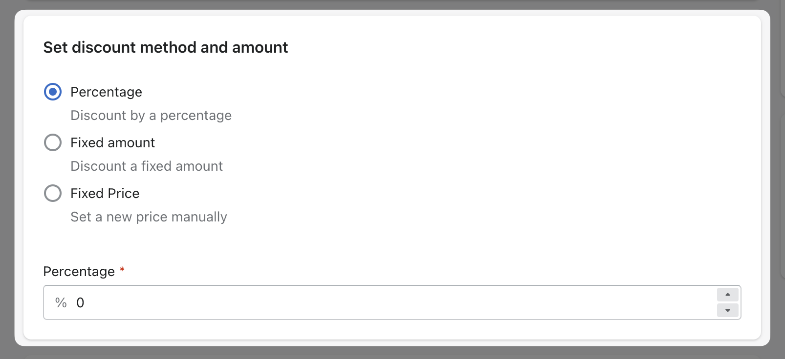

import Bleed from 'nextra-theme-docs/bleed'
import Callout from 'nextra-theme-docs/callout'

# New Promo

<Bleed></Bleed>

When creating a new promo, you will need to specify the following:

- A title
- A discount method
- The amount for the discount / new price
- The items included in the promotion
- The Activation method

## Title

This is an easy one 😊 - just type in the title of the promo. It will be displayed in the app only, this is used only for internal purposes, in order to reference your promos.

<Bleed></Bleed>

## Discount method and amount

You can choose among the following methods:

1. `Fixed amount` - the discount will be a fixed amount (e.g. `old price minus $10`)
2. `Percentage` - the discount will be a percentage of the price (e.g. `old price minus 10%`)
3. `Fixed Price` - sets a brand new price to the selected products (e.g. `New price is $5`)

Once you've picked your method, just add the amount to apply the discount on selected items.

<Bleed></Bleed>

## Items included in the promotion

There are 3 ways of selectiing items:

1. `Products` - Hand pick products variants to include in the promotion, you can also pick one certain variants (Max 100 items)
2. `Collections` - Apply a discount to a whole collection (Max 100 items)
3. `Custom` - Create conditions to filter certain products based on some of their properties like `price`, `SKU`, `stock`, `title`, `product type` and `tags`. (Max 100 items)

<Bleed></Bleed>
<Bleed></Bleed>
<Bleed></Bleed>

## Activation method

Here you can choose how the promotion will be activated:

1. `Manually` - the promotion will be created but it will not be active until you activate it manually
2. `Scheduled` (_Pro and Unlimited plan_) - the promotion will be created and activated automatically at a certain date and time based on your choice. You can also choice only a start date or both start and end date

<Callout>All the schedules are based on your current timezone.</Callout>

<Bleed></Bleed>
