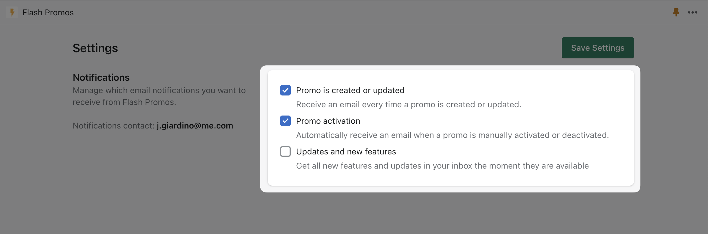

import Bleed from 'nextra-theme-docs/bleed'

# Settings / Notifications

After you've installed **Flash Promos**, you will receive a first welcome email, however all the other notifications will be turned off until you tick the boxes, meaning we won;t send you any emails until you've given us consent.

There are three different types of notifications:

    * **Promo is created or updated**: Receive an email every time a promo is created or updated.
    * **Promo activation**: Automatically receive an email when a promo is manually activated or deactivated..
    * **Updates and new features**: Get all new features and updates in your inbox the moment they are available.

<Bleed></Bleed>
